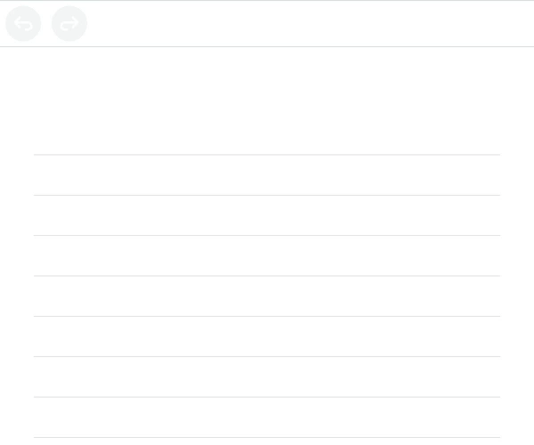

# MyScript Text Web
> The easy way to integrate text handwriting recognition in your web app.

<p align="center">
  
</p>

`myscript-text-web` is a Web component that can be used in every web application to bring text handwriting recognition and conversion. 

It integrates all you need:  
* Signal capture for all devices,
* Digital ink rendering,
* Link to MyScript Cloud to bring handwriting recognition.

## Table of contents

* [Examples](https://github.com/MyScript/myscript-text-web#examples)
* [Features](https://github.com/MyScript/myscript-text-web#features)
* [Requirements](https://github.com/MyScript/myscript-text-web#requirements)
* [Installation](https://github.com/MyScript/myscript-text-web#installation)
* [Usage](https://github.com/MyScript/myscript-text-web#usage)
* [Documentation](https://github.com/MyScript/myscript-text-web#documentation)
* [Support](https://github.com/MyScript/myscript-text-web#support)
* [Feedback](https://github.com/MyScript/myscript-text-web#sharing-your-feedback)
* [Contributing](https://github.com/MyScript/myscript-text-web#contributing)


## Examples

If you're not familiar with MyScript and Interactive Ink, consider discovering its major features with our [text demo and tutorial](http://webdemo.myscript.com/views/text.html).

You can find on our examples page a [simple example](https://myscript.github.io/myscript-text-web/components/myscript-text-web/#/elements/myscript-text-web/demos/get-started-[v4]) of `myscript-text-web`. 

We also provide several examples to show the features of `myscript-text-web`. Those examples can be found on our [examples page](https://myscript.github.io/myscript-text-web/components/myscript-text-web/#/elements/myscript-text-web/demos/other-examples) with the source codes in [this directory](https://github.com/MyScript/myscript-text-web/tree/master/examples).

## Features

* Easy to integrate,
* Digital ink capture and rendering,
* Rich editing gestures,
* Import and export content,
* Styling,
* Typeset support,
* 59 supported languages.

You can discover all the text features on our [Developer website](https://developer.myscript.com/text).

## Requirements

1. Have [bower](https://bower.io/#install-bower) installed.
2. Have a MyScript developer account. You can create one [here](https://dev.myscript.com/).
2. Get your keys and the free monthly quota to access MyScript Cloud at [developer.myscript.com](https://developer.myscript.com)
 
## Installation

1. Download myscript-text-web.
```shell
bower install myscript-text-web
```

## Usage

1. Create an `index.html` file in the same directory. 

2. Add the following lines in the `head` section to import the library, the webcomponents polyfill and PEP. We use [PEP](https://github.com/jquery/PEP) to ensure better browsers compatibilities.
```html
<link rel="import" href="bower_components/myscript-text-web/myscript-text-web.html">
<script src="bower_components/webcomponentsjs/webcomponents-loader.js"></script>
<script src="https://code.jquery.com/pep/0.4.3/pep.js"></script>
```  

3. Still in the `head` section, add the following style:
```html
<style>
    myscript-text-web {
        height: 100%;
    }
</style>
```

4. Use the component in the `body` section with the keys you received by mail.  
```html
<myscript-text-web
  applicationkey="YOUR MYSCRIPT DEVELOPER APPLICATION KEY"
  hmackey="YOUR MYSCRIPT DEVELOPER HMAC KEY">
</myscript-text-web>
```

5. Your `index.html` file should look like this:
```html
<html>
    <head>
        <link rel="import" href="bower_components/myscript-text-web/myscript-text-web.html">
        <script src="bower_components/webcomponentsjs/webcomponents-loader.js"></script>
        <script src="https://code.jquery.com/pep/0.4.3/pep.js"></script>
        <style>
            myscript-text-web {
                height: 100%;
            }
        </style>
    </head>
    <body>
      <myscript-text-web
        applicationkey="YOUR MYSCRIPT DEVELOPER APPLICATION KEY"
        hmackey="YOUR MYSCRIPT DEVELOPER HMAC KEY">
      </myscript-text-web>
    </body>
</html>
```

6. Launch a local Web server like the one below and open the page in your browser (at [0.0.0.0:8000](http://0.0.0.0:8000) if you used the one below) to start using it!
```
python -m SimpleHTTPServer
```

You can find this guide and a more complete example on the [MyScript Developer website](https://developer.myscript.com/docs/interactive-ink/latest/web/web-components/text-element/get-started/).

## Documentation

You can find a complete documentation with the following sections on our Developer website:

* **Get Started**: [how to use myscript-text-web with a full example](https://developer.myscript.com/docs/interactive-ink/latest/web/web-components/text-element/get-started/),
* **Editing**: [how to interact with content](https://developer.myscript.com/docs/interactive-ink/latest/web/web-components/text-element/editing/),
* **Conversion**: [how to convert your handwritten content](https://developer.myscript.com/docs/interactive-ink/latest/web/web-components/text-element/conversion/),
* **Import and Export**: [how to import and export your content](https://developer.myscript.com/docs/interactive-ink/latest/web/web-components/text-element/import-and-export/),
* **Styling**: [how to style content](https://developer.myscript.com/docs/interactive-ink/latest/web/web-components/text-element/styling/).

We also provide a complete [API Reference](https://myscript.github.io/myscript-text-web/components/myscript-text-web/#/elements/myscript-text-web).


## Getting support

You can get support and ask your questions on the [dedicated section](https://developer-support.myscript.com/support/discussions/forums/16000096021) of MyScript Developer website.

## Sharing your feedback

Made a cool app with `myscript-text-web`? We would love to hear about you!
We’re planning to showcase apps using it so let us know by sending a quick mail to [myapp@myscript.com](mailto://myapp@myscript.com)

## Contributing

We welcome your contributions: if you wish to contribute to `myscript-text-web`, feel free to fork it!

Please take a look at our [contributing](CONTRIBUTING.md) guidelines before submitting your pull request.

## License

This library is licensed under the [Apache 2.0](http://opensource.org/licenses/Apache-2.0).
